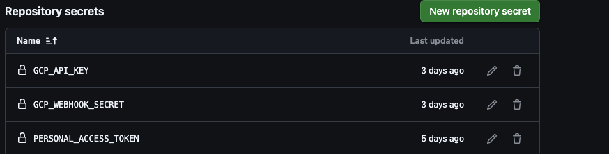
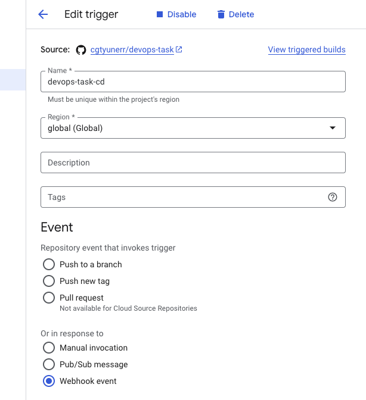
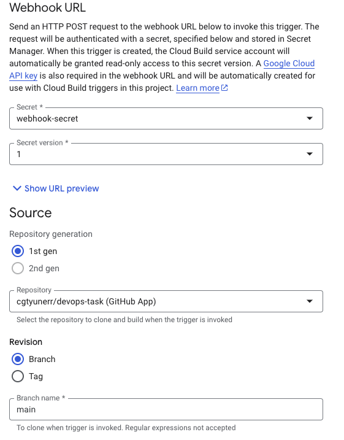
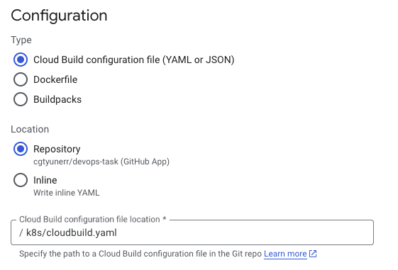

# CI/CD

## Table of contents
* [General Information](#general-information)
* [CI](#ci)
* [CD](#cd)

## General Information
All the CI/CD process are made by github workflows and Google build api. .github/test.yml is completely about CI process. 
It makes project tests, necessary checks and necessary caching.

## CI
We can divide 4 stage to our CI process.

### 1) Running Stage 
Firstly we must run our workflows on a docker image. We choose "Ubuntu" for this 
stage because a lot of tools is installed inside of it.

### 2) Preparing Stage
After run the workflow, we prepare environment to our main purpose. In this stage, we checkout our code, install python, 
start docker compose for up a database for our tests, install poetry and cache 
dependencies to reduce our waiting time for next CI processes.

### 3) Test Stage
Firstly we install pre-commit and pre-commit check code standard, code security and potential errors by using
.pre-commit-config.yml. After that we create test environment and make project tests(unit, integration, e2e).

## CD
### Github Stage
In this stage we need some repository secret creations in our repo. In repository->settings->secrets and variables->actions we need to create 3 secrets.

We obtain GCP secrets in GCP. We must create personal access token in github.
When push event is happened, this trigger on push in main.yml. If this push is not about main branch, 
just test in test.yml is triggered. However, if this push is about main branch test and release stages are triggered. 
Test stage is same with CI process. In this project, we use commitizen for conventional commits and version system.
In release, commitizen check is new version happened. If happened, it update or create CHANGELOG.md and create new
version by using PAT(personal access token). When new version is released, stage in docker.yml is triggered. It creates 
new docker image and push it ghcr.io and it triggered gcp with webhooks by using GCP secrets.

### GCP stage
To trigger cloud in github, we must do the following:
All the steps are happened in cloud build side of the gcp.
- Firstly, we must connect to the repository in cloud build.
- After that we must create a trigger, repository connection and trigger must be in same region.

We choose region, We must choose webhook event as a trigger type.

We choose repository. Revision is not important because we trigger cloud build in github workflows. We must create a 
secret for webhook and if we press "show URL preview" button, we see our url that is used for initializing CD process
in cloud. We must create action secret in github by using key and secret in this url.

"cloudbuild.yaml" must be created because build api execute the commands that is in.

- In our scenario, the images was build in docker.yml according to this naming "ghcr.io/cgtyunerr/devops-task:
latest-api-{commitizen-version}". We must send commitizen version to gcp to create container in GCP with correct image.
We use substitutions for this purpose. Send version to GCP as a body parameter.
